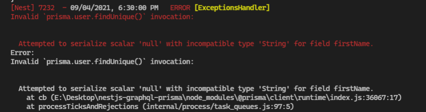
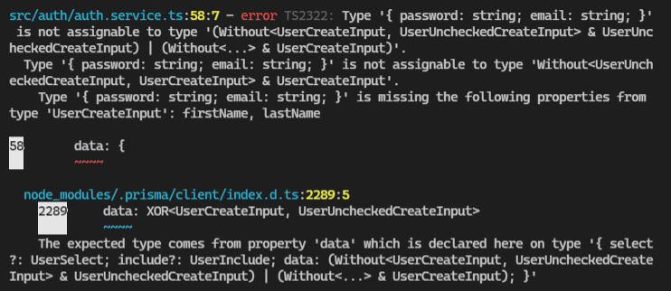
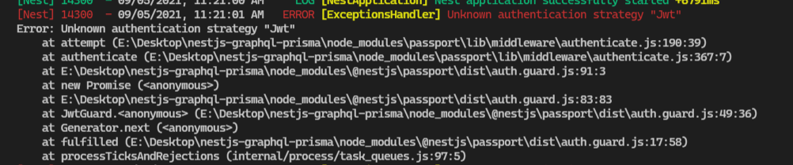
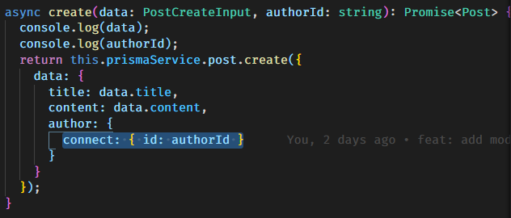
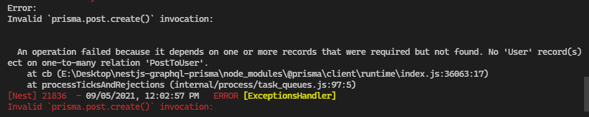

## Part 1:
### Project setup 
```
nest new project_name
```
### Initial resolver (create partial)
- create module
```
nest g module pets
```

- create service
```
nest g service pets
```

- create resolver
```
nest g resolver pets
```

### For quickly creating a CRUD controller with the validation built-in, you may use the CLI's CRUD generator (create full module with module, controller, service, dto,...) 
```
nest g resource [name].
```

### Generate GraphQL schema

add config GraphQl in app module
## Part 2:
### Database integration with Prisma
```
npx prisma init
```
- install and generate Prisma Client
```
npm i @prisma/client
```
or
```
npx prisma generate
```
### Querying the database

## Part 3:
### Mutations
### Validation
### Auto generate all the things 
### Db relationship

## Notes:
Prisma require using mongo support transaction (mongo replica set)
Nếu sử dụng prisma thì không cần file service mà query trực tiếp trong resolver cũng được

### Folder dto
- `REST API` => *.dto.ts
- `GraphQR` => *.input.ts

### Common error
1. [Prisma] exists a field require in .prisma but not exists in db. Trường hợp thay đổi schema.prisma. nếu dữ liệu cũ không có field mới mà field mới require trong schema.prisma thì sẽ bị lỗi này



2. [Gql] Lỗi này do khai báo type không hợp lệ. input hoặc return giữa prisma và service không khớp



3. [Authorization]Chưa import strategy('jwt') vào provider của auth.module



4. [Prisma] Lỗi sử dụng toán tử connect nhưng không tìm thấy record để connect trong db (không tìm thấy user có `id = authorId` đó trong db)


